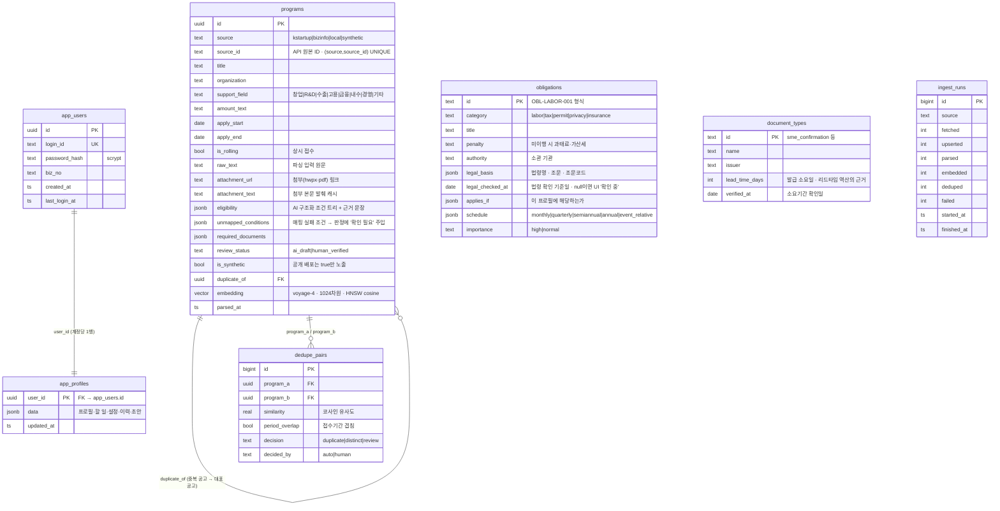

# 브릿지 DB — ERD

Supabase(PostgreSQL 17 + pgvector). 스키마 전체는 [`schema.sql`](./schema.sql), 원본 마이그레이션은 [`../../supabase/migrations/`](../../supabase/migrations/)에 있습니다.

## 설계 의도

**카탈로그(공개 데이터)와 사용자 데이터를 분리했습니다.** `programs`·`obligations`·`document_types`·`dedupe_pairs`는 모든 사용자가 공유하는 공개 카탈로그이고, `app_users`·`app_profiles`는 계정 데이터입니다. 판정 엔진은 카탈로그만 읽고, 판정 자체는 브라우저에서 실행됩니다.

**`programs.eligibility`가 이 DB의 핵심입니다.** 공고 원문을 Claude가 구조화한 조건 트리인데, 모든 조건에 근거가 된 원문 문장(`source_text`)이 함께 저장됩니다. 화면에서 요건을 클릭하면 그 문장이 그대로 펼쳐지고, AI가 필드에 매핑하지 못한 조건은 `unmapped_conditions`로 따로 남겨 판정 결과에 '확인 필요'를 강제 주입합니다 — AI가 확신 없이 판정하지 않게 만드는 장치입니다.

**`embedding`은 중복 판별용입니다.** 같은 사업이 K-Startup과 기업마당에 각각 올라오는 일이 잦아서, Voyage 임베딩(1024차원)을 HNSW 코사인 인덱스로 검색해 후보를 찾습니다. 다만 병합 여부는 임베딩이 정하지 않고 `유사도 ≥ 0.92 AND 접수기간 겹침`이라는 규칙이 정하며, 그 근거를 `dedupe_pairs`에 남깁니다.

**RLS는 기본 차단입니다.** `app_users`·`app_profiles`는 anon·authenticated 권한을 모두 회수해 정책이 하나도 없고, service role로만 접근합니다. 카탈로그 테이블은 읽기 정책만 두되 `programs`는 `is_synthetic = true`인 행만 익명 조회를 허용해, 공개 배포본에서 합성 데이터만 노출되도록 DB 계층에서 한 번 더 막았습니다.
